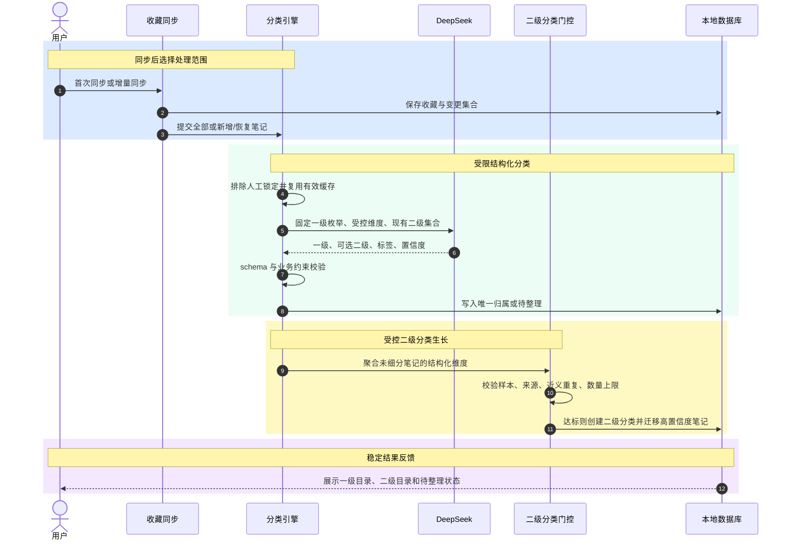

# ADR-0001：采用受控层级自动分类，禁止相似度驱动类别生长

- 状态：Accepted
- 日期：2026-08-27
- 决策者：项目维护者
- 关联需求：[`spec/002-constrained-auto-classification/spec.md`](../../spec/002-constrained-auto-classification/spec.md)

## 背景

集示当前分类实现包含三条路径：固定粗分类、embedding 相似度增量匹配、超过数量阈值后的 AI 裂变。现有粗分类共有 18 个；embedding 会把新笔记与现有分类画像比较；裂变主要由父分类笔记数量触发。

相似度可以回答“两个表达有多接近”，但不能可靠回答“用户需要多少个目录”。当类别创建或归属过度依赖相似度阈值时，近义表达、不同粒度和不同分类维度会同时变成目录，导致：

- 类别数量随数据增长持续膨胀；
- 同义或包含关系分类并存；
- 阈值对不同主题不具备统一意义；
- 新数据可能改变已有目录结构；
- 用户难以预测系统会如何整理收藏。

本项目近期面向个人及小范围内测，自动分类体验优先于扩展为通用开放分类平台。

## 决策

采用“固定一级分类 + 受控二级分类 + 多标签”的层级模型，并作出以下约束：

1. 一级分类固定为 10 个内容主题加“其他”，AI 只能从枚举中选择。
2. 每条成功分类的笔记只能有一个一级分类、最多一个二级分类，可以有多个标签；待整理笔记允许暂时没有分类归属。
3. 二级分类可以由 AI 自动创建，但只能使用各一级分类预定义的裂变维度。
4. 二级分类创建同时受最小样本量、来源数、近义去重和每个一级最多 6 个的限制。
5. 二级分类最多一层，不允许创建三级分类。
6. 默认使用增量稳定策略；已有分类不因普通同步被重排。
7. 人工调整具有最高优先级，自动流程不得覆盖人工锁定结果。
8. DeepSeek 使用受 schema 约束的结构化输出完成分类。
9. Embedding 不参与分类、裂变、合并或类别创建；未来只可用于语义搜索和相似内容推荐。
10. 模型失败或低置信度内容进入“待整理”，“其他”保留为正式分类。

## 决策流程



## 固定一级分类

固定集合为：美食、旅行出行、穿搭美妆、居家生活、学习职场、运动健康、亲子宠物、数码科技、娱乐兴趣、情感成长、其他。

“好物推荐”不作为一级分类，因为它表达的是内容形式或消费意图，而不是稳定主题。对应笔记按商品领域归类，并使用“种草”“测评”“想买”等标签表达意图。

## 二级分类门控

自动创建二级分类必须满足：

```text
minCandidateCount = max(8, min(20, ceil(parentActiveCount × 10%)))
```

并且：

- 至少来自 3 个不同作者或内容来源；
- 名称符合该一级分类允许的裂变维度；
- 与已有二级分类不存在同义、近义或包含关系；
- 每个一级分类最多已有 5 个二级分类，创建后总数不超过 6 个；
- 只迁移未人工锁定且高置信度匹配的笔记；
- 未达标内容留在一级分类，不创建兜底二级目录。

## 目标数据模型约束

后续实现不要求立即引入特定 ORM，但持久化模型必须能表达以下不变量：

| 概念 | 必要信息 | 约束 |
|---|---|---|
| Category | ID、名称、层级、父 ID、系统键、裂变维度、来源、状态 | 一级无父 ID；二级必须有且只有一个一级父分类 |
| NoteClassification | 笔记 ID、处理状态、可选一级 ID、可选二级 ID、来源、置信度、人工锁定、分类版本 | 笔记 ID 唯一；成功状态必须有一级；待整理状态允许无一级；二级必须属于指定一级 |
| Tag | ID、规范名称、类型 | 同类型同规范名称唯一 |
| NoteTag | 笔记 ID、标签 ID、来源 | 笔记与标签唯一关联 |
| ClassificationCache | 输入指纹、规则版本、模型版本、结构化结果、状态 | 指纹和版本均未变化时才可复用 |
| ClassificationPreview | 重整批次、变更前后归属、操作类型 | 全量重整确认前不得修改正式归属 |
| CreationSuppression | 一级 ID、候选规范键、抑制版本 | 用户撤销后避免同一候选立即重建 |

必须由数据库约束或事务内校验保证：唯一一级归属、可选唯一二级归属、二级父级一致、人工锁定不可被自动写入覆盖。

## 增量与全量策略

- 首次成功同步后处理全部未分类笔记。
- 后续只处理新增和恢复笔记。
- 输入指纹与分类规则版本未变化时复用缓存。
- 普通增量流程不得自动删除、合并或改名已有二级分类。
- 全量重新整理必须由用户主动触发，先生成变更预览，确认后事务化应用。
- 人工锁定内容默认不进入全量重算。

## 现有分类迁移

| 现有粗分类 | 目标一级分类 |
|---|---|
| 做饭料理、美食探店 | 美食 |
| 旅游出行 | 旅行出行 |
| 穿搭、美妆护肤 | 穿搭美妆 |
| 装修家居 | 居家生活 |
| 学习成长、职场 | 学习职场 |
| 健身锻炼、健康养生 | 运动健康 |
| 母婴亲子、宠物 | 亲子宠物 |
| 数码科技 | 数码科技 |
| 影视娱乐、摄影拍照 | 娱乐兴趣 |
| 情感心理 | 情感成长 |
| 其他 | 其他 |
| 好物推荐 | 根据商品主题重新受限分类；无法判断时进入待整理 |

旧规则分类中的“礼物”不再作为主题一级分类，应根据礼物对象本身归入对应主题，并增加“礼物”标签。

迁移时保留人工锁定结果。若旧人工分类无法映射到新一级分类，应进入迁移预览，不得静默改写。

## 结果

### 正面影响

- 首页结构稳定，用户可以形成长期空间记忆。
- 类别数量具有明确上限，不会随相似度波动无限增长。
- 标签保留跨主题信息，不需要复制笔记到多个目录。
- 仅依赖一个模型服务，减少 API Key 配置和两套模型结果不一致。
- 分类规则可以通过明确的业务不变量和验收场景测试。

### 代价与风险

- 固定一级分类不能覆盖所有人的个性化组织方式。
- 大模型的自报置信度不等于真实准确率，需要标注样本持续校准。
- 受控维度和同义归一规则需要随真实数据维护。
- 不使用 embedding 分类后，每条新笔记通常需要一次 LLM 判断，需通过批处理和缓存控制成本。
- 最多 6 个二级分类可能让长尾主题继续停留在一级分类，这是有意接受的取舍。

## 被否决的方案

### 相似度驱动的开放分类

否决原因：相似度阈值不能决定目录数量和粒度，容易产生大量近义分类，且不同主题需要不同阈值。

### 完全固定、没有二级分类

否决原因：目录稳定但缺乏个人化，收藏量增长后一级分类内部仍难以浏览。

### 让大模型自由聚类并命名

否决原因：分类维度、粒度和名称会随批次漂移，难以保证增量稳定。

### 一条笔记进入多个文件夹

否决原因：造成重复计数、重复展示、人工调整冲突和裂变归属不清；跨主题信息改由多标签表达。

### 无限层级裂变

否决原因：移动端浏览成本高，且自动分类错误会在树中逐层放大。

## 后续验证

- 建立覆盖十个一级分类、“其他”和“待整理”的人工标注样本集。
- 分别统计一级准确率、待整理率、人工纠正率和二级分类撤销率。
- 使用真实收藏规模验证自动创建门槛与每类最多 6 个的限制。
- 为旧分类到新分类的映射和人工锁定保护补充数据库迁移回归测试。
