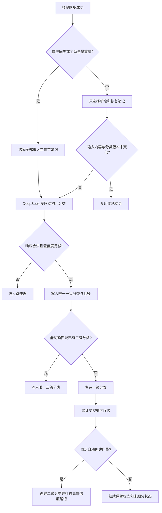

# 受控层级自动分类需求规格

- 状态：已确认
- 决策日期：2026-08-27
- 适用产品：集示 Android
- 关联 ADR：[`docs/adr/0001-constrained-hierarchical-classification.md`](../../docs/adr/0001-constrained-hierarchical-classification.md)

## 1. 背景

集示需要把用户同步到本地的小红书收藏自动整理为可浏览的目录。已有实现采用固定粗分类、关键词 embedding 相似度匹配和按数量裂变。实际使用中，相似度驱动的开放分类容易把相近表达识别为多个类别，造成分类数量持续膨胀、名称漂移和目录结构不稳定。

本需求将分类改为受控层级模型：一级分类固定，AI 只能在固定集合中选择；二级分类可以自动生长，但创建维度、样本门槛、数量和层级均受限制；标签负责表达跨主题语义。

## 2. 产品边界与目标

### 2.1 产品边界

- 第一阶段面向个人及小范围内测，不以应用商店上架为近期目标。
- 只处理用户自己的收藏数据。
- 收藏索引和分类结果默认保存在本机。
- AI 分类只发送完成分类所需的标题、摘要和分类上下文，不发送 Cookie、接口签名、账号凭据、图片文件或完整原始响应。

### 2.2 第一优先级

第一阶段优先验证自动分类体验，包括：目录是否稳定、分类是否容易理解、二级分类是否有实际浏览价值，以及新增收藏能否自动进入合适位置。

### 2.3 成功标准

- 所有成功分类的笔记有且只有一个一级分类；待整理笔记在完成分类前可以没有一级归属。
- 自动分类不会创建新的一级分类。
- 单条新笔记不会触发二级分类创建。
- 二级分类不会超过两层目录结构，也不会无限增长。
- 后续增量同步默认不改变已有稳定分类。
- 人工调整不会被自动分类覆盖。
- 分类失败不会影响收藏同步和已有内容浏览。

## 3. 术语

| 术语 | 定义 |
|---|---|
| 一级分类 | 系统固定的内容主题分类，AI 不可新增、删除或改名 |
| 二级分类 | 一级分类内根据受控维度自动生成的细分目录 |
| 标签 | 描述地点、对象、场景、动作或意图的多值属性，不参与目录计数 |
| 未细分 | 已确定一级分类，但尚未形成稳定二级主题的笔记状态 |
| 其他 | 模型有把握认为不属于十个主题类的正式一级分类 |
| 待整理 | 模型失败、输入不足、返回异常或低置信度时进入的临时工作区 |
| 人工锁定 | 用户移动或修正分类后，禁止自动流程覆盖该结果 |

## 4. 分类信息模型

### 4.1 唯一归属

每条成功分类的笔记必须满足：

- 有且只有一个一级分类；
- 最多有一个二级分类，允许为空；
- 可以有多个标签；
- 待整理是临时处理状态，不等同于“其他”，处于待整理时允许暂无一级和二级归属；
- 人工调整后进入人工锁定状态。

示例：

```text
标题：上海咖啡店拍照攻略
一级分类：美食
二级分类：上海探店
标签：咖啡店、拍照、约会
```

### 4.2 固定一级分类

| 标识建议 | 名称 | 说明 |
|---|---|---|
| `food` | 美食 | 做饭、菜谱、餐厅、咖啡、烘焙及饮食内容 |
| `travel` | 旅行出行 | 目的地、景点、住宿、路线和周边游 |
| `style_beauty` | 穿搭美妆 | 服饰、鞋包、妆容、护肤、发型和美甲 |
| `home_life` | 居家生活 | 装修、家居、收纳、家务及生活空间 |
| `learning_career` | 学习职场 | 学习、考试、技能、求职和工作方法 |
| `sports_health` | 运动健康 | 运动、训练、健康管理、睡眠和养生 |
| `family_pets` | 亲子宠物 | 育儿、亲子活动、宠物饲养及宠物健康 |
| `digital_tech` | 数码科技 | 数码产品、软件工具、设备使用和科技内容 |
| `entertainment_hobbies` | 娱乐兴趣 | 影视、音乐、游戏、摄影及其他兴趣内容 |
| `emotion_growth` | 情感成长 | 恋爱、人际关系、心理和自我成长 |
| `other` | 其他 | 明确不属于以上主题的正式分类 |

空的一级分类不在首页展示。“好物推荐”属于内容形式或收藏意图，不作为一级分类；内容应按商品所属主题归类，并附加“种草”“测评”“想买”等标签。

### 4.3 二级裂变维度

AI 只能按照下表允许的维度生成二级分类：

| 一级分类 | 允许的二级维度 | 示例 |
|---|---|---|
| 美食 | 菜品类型、探店城市 | 烘焙甜品、上海探店 |
| 旅行出行 | 目的地 | 新疆旅行、日本旅行 |
| 穿搭美妆 | 场景、品类 | 通勤穿搭、底妆技巧 |
| 居家生活 | 空间、家务主题 | 厨房收纳、客厅装修 |
| 学习职场 | 技能、考试、工作任务 | 英语学习、简历面试 |
| 运动健康 | 运动类型、健康目标 | 跑步训练、睡眠改善 |
| 亲子宠物 | 年龄阶段、宠物类型 | 幼儿辅食、养猫日常 |
| 数码科技 | 产品品类、软件用途 | 相机设备、效率软件 |
| 娱乐兴趣 | 内容类型、具体爱好 | 电影推荐、人像摄影 |
| 情感成长 | 关系类型、成长议题 | 恋爱关系、自我成长 |
| 其他 | 不允许自动裂变 | — |

AI 不得创建“周末必看”“宝藏合集”“生活灵感”等不符合允许维度、含义模糊的二级分类。

## 5. 分类流程



### 5.1 模型职责

DeepSeek 输出受 schema 约束的结构化结果，至少包含：

- 一级分类标识；
- 一级分类置信度；
- 允许维度下的结构化字段；
- 规范化标签；
- 可选的现有二级分类标识；
- 简短判定理由，用于调试和变更预览。

模型必须在固定一级分类集合中选择，不得返回新一级分类。Embedding 不参与一级分类、二级归属、裂变或合并决策。

### 5.2 “其他”与“待整理”

- 一级分类置信度达到 `0.75` 且模型明确判断不属于十个主题类时，进入“其他”。
- 模型调用失败、超时、响应不符合 schema、输入不足或置信度低于 `0.75` 时，进入“待整理”。
- 待整理可在补充元数据或重试后自动移出。
- 其他默认保持稳定，仅在用户主动全量重新整理时重新判断。

模型返回的置信度只能作为流程信号，不作为准确率证明；最终质量应通过人工标注样本评估。

## 6. 二级分类自动创建规则

AI 可以直接创建二级分类，不需要逐次人工确认，但必须同时满足以下条件：

1. 候选名称符合所属一级分类允许的裂变维度；
2. 候选笔记数达到以下门槛：

   ```text
   minCandidateCount = max(8, min(20, ceil(parentActiveCount × 10%)))
   ```

3. 候选笔记至少来自 3 个不同作者或内容来源；
4. 候选与已有二级分类不是同义、近义或包含关系；
5. 一级分类当前二级分类数量少于 6 个；
6. 只迁移未被人工锁定且高置信度匹配的笔记；
7. 未覆盖的笔记继续直接留在一级分类下；
8. 不允许创建三级分类。

门槛示例：一级分类有 50 条时门槛为 8 条；有 120 条时为 12 条；有 500 条时上限为 20 条。

达到 6 个二级分类后，新笔记只能匹配现有二级分类或留在一级分类。系统不得通过改名规避数量上限。

## 7. 稳定性与人工控制

### 7.1 默认增量稳定

- 首次分类处理全部可分类笔记。
- 后续同步只分类新增和恢复笔记。
- 已有笔记默认不移动。
- 自动创建二级分类时，只允许迁移未人工锁定的高置信度笔记。
- 自动流程不得删除、合并或改名已有二级分类。

### 7.2 人工调整优先

- 用户移动一级或二级分类后，笔记立即人工锁定。
- 用户可以解除人工锁定，再交给自动分类。
- 用户可以修改、合并或删除二级分类；删除时需选择把笔记留在一级分类还是移动至另一个二级分类。
- 人工创建的二级分类同样受一级归属和最多一层的结构约束，但不受自动创建样本门槛限制。

### 7.3 全量重新整理

- 只有用户主动触发时才允许全量重算。
- 执行前展示预计处理笔记数。
- 应先生成变更预览，列出将移动的笔记、将新建的二级分类和待整理数量。
- 用户确认后才应用变更。
- 人工锁定内容默认不参与；用户必须显式选择才能包含。

## 8. 触发与失败处理

- 首次全量同步成功后自动执行全量分类。
- 后续每次完整同步成功后，自动分类新增和恢复笔记。
- 输入内容及分类规则版本未变化时复用缓存，不重复调用模型。
- 模型失败不回滚已经完成的同步，也不影响已有本地浏览。
- 失败笔记进入待整理，首页提供“重试分类”。
- 首页提供独立的“全量重新整理”入口。
- 批次内部分失败时，只重试失败项，不重复处理成功项。

## 9. 界面需求

- 首页只展示非空一级分类、笔记总数和封面预览。
- “待整理”作为独立入口展示数量和失败原因摘要。
- 进入一级分类后展示二级分类；未进入二级分类的笔记仍可在一级分类列表中浏览。
- 二级分类最多一层，不展示三级入口。
- 搜索结果可以直接定位笔记，并展示一级分类、二级分类和标签路径。
- 自动创建二级分类后提供可撤销反馈；撤销后笔记返回一级分类，相关候选在当前分类版本内不得立即重复创建。

## 10. 数据与隐私要求

- DeepSeek API Key 使用 Android Keystore 支持的安全存储，禁止明文日志输出。
- 发送给模型的字段限定为标题、必要摘要、现有分类名称和受控维度定义。
- 禁止发送 Cookie、`user_id`、接口签名头、图片、完整原始 JSON 和无关账号数据。
- 模型请求、响应原文不得写入普通日志；诊断日志只记录批次 ID、数量、耗时、结果状态和脱敏错误类型。
- 分类结果、标签和输入摘要缓存可由用户清除；清除缓存不能破坏笔记 ID 和人工锁定结果。

## 11. 性能与可测试性

- 分类在后台协程执行，不阻塞 Compose 主线程。
- 模型请求按批次处理，支持超时、取消、指数退避和失败项重试。
- 分类结果必须经过本地 schema 校验后才能写库。
- 分类写入使用事务，批次失败不能留下一级和二级归属不一致的中间状态。
- 至少覆盖以下自动化测试：固定枚举约束、唯一一级归属、可选唯一二级归属、人工锁定、待整理降级、创建门槛、二级数量上限、禁止三级分类、增量稳定和全量预览。

## 12. 明确不做

- 不通过 embedding 相似度创建、拆分或决定分类。
- 不允许 AI 创建、删除或改名一级分类。
- 不允许自由聚类直接生成目录。
- 不允许一条笔记同时归入多个一级或二级文件夹。
- 不自动生成三级及更深层级。
- 不在默认增量流程中自动合并、删除或改名已有二级分类。
- 第一阶段不实现基于 embedding 的语义搜索；仅为未来能力保留边界。

## 13. 验收场景

### 场景 A：首次分类

给定 300 条未分类收藏，完成分类后每条有效笔记只有一个一级分类；空一级分类不展示；低置信度或失败项进入待整理。

### 场景 B：受控自动裂变

给定“美食”有 120 条，其中 14 条稳定表达上海探店，且来源不少于 3 个，系统可以自动创建“上海探店”；只有 7 条时不得创建。

### 场景 C：分类数量受限

给定某一级分类已有 6 个二级分类，即使出现新的高频主题，也不得创建第 7 个二级分类，新笔记应匹配已有分类或留在一级分类。

### 场景 D：增量稳定

同步 10 条新增收藏后，只处理这 10 条以及需要恢复的笔记；已有稳定笔记不因本次同步改变归属。

### 场景 E：人工锁定

用户把笔记移动到指定分类后，后续自动分类、自动裂变和默认全量重整均不得移动该笔记。

### 场景 F：模型故障

DeepSeek 超时或返回非法 JSON 时，同步数据仍然保留；失败笔记进入待整理，用户可以稍后单独重试。

## 14. 当前实现进度

第一阶段核心分类链路已经落地：

- 一级分类已迁移为 10 个主题类加“其他”，模型输出经过固定枚举、置信度和裂变维度校验；
- 增量分类已移除 embedding 决策，统一使用 DeepSeek JSON 结构化输出；
- 二级分类创建已加入样本量、来源数、名称去重、高置信度和每个一级最多 6 个的门控；
- 数据库已能表达两层分类、唯一笔记归属、标签、分类版本、缓存、迁移预览和创建抑制；
- API Key 已改用 Android Keystore 支持的加密存储，模型请求和响应原文不再写入日志。

下一阶段仍需完成：

- 一级分类详情中的二级目录与标签路径展示；
- 全量重新整理的预览、确认和事务化应用流程；
- 二级分类撤销后的创建抑制交互；
- 人工移动、锁定与解除锁定的完整界面；
- 模型请求的指数退避、失败项单独重试以及数据库迁移自动化测试。
